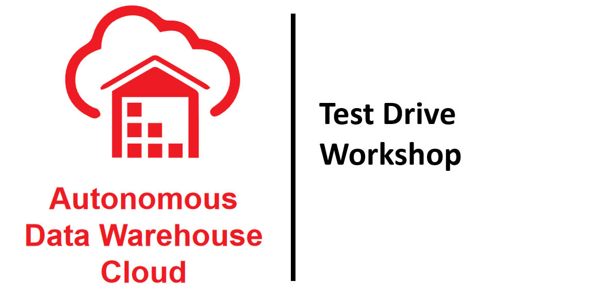

  

July 1, 2018
    
# ADWC Journey: Hands-On Test Drive Workshop
This workshop walks you through all the steps to get started using the **Oracle Autonomous Data Warehouse Cloud (ADWC)**. You will provision a new ADWC database, load data from the object store and troubleshoot data loads, query external data residing on the object store, manage an ADWC instance, scale an ADWC instance, and use Oracle Machine Learning notebooks.

## Goals

 - Get comfortable with Oracle's public cloud services
 - Provision a new ADWC database
 - Run sample queries against the sample data sets
 - Load data from the object store
 - Query external data from the object store
 - Manage and Monitor an ADWC instance
 - Scale an ADWC instance
 - Use Oracle Machine Learning notebooks
 - Use Oracle Data Visualization Desktop (DVD) with ADWC
 - Use Oracle Data Integration Platform Cloud (DIPC) with ADWC
 

## To Learn More
 - [Oracle Autonomous Data Warehouse Cloud website](https://www.oracle.com/database/data-warehouse/index.html)
 - [Oracle Autonomous Data Warehouse Cloud ipaper](http://www.oracle.com/us/products/database/autonomous-dw-cloud-ipaper-3938921.pdf)
 - [Oracle Autonomous Data Warehouse Cloud Documentation](https://docs.oracle.com/en/cloud/paas/autonomous-data-warehouse-cloud/index.html)
 - [Additional Autonomous Data Warehouse Cloud Tutorials](https://docs.oracle.com/en/cloud/paas/autonomous-data-warehouse-cloud/tutorials.html)
 
      
## How to View the Lab Guides

- The Labguides are best viewed using the Workshop's [GitHub Pages Website URL](https://oracle.github.io/learning-library/workshops/journey4-adwc/) 

- Once you are viewing the Workshop's GitHub Pages website, you can see a list of Lab Guides at any time by clicking on the **Menu Icon**

      

- To **log issues**, click [here](https://github.com/millerhoo/journey4-adwc/issues/new) to go to the github oracle repository issue submission form.

# Workshop Details

## Lab 100: Provisioning and Connecting

**Documentation**: [LabGuide100StartHereNEW.md](LabGuide100StartHereNEW.md)

**Objectives**:

- Learn how to sign-in to the Oracle Public Cloud
- Learn how to provision a new ADWC database
- Learn how to download the client credentials wallet file
- Learn how to connect from Oracle SQL Developer

## Lab 200: Working with Database Services and Sample Data Sets

**Documentation**: [LabGuide200.md](LabGuide200.md)

**Objectives**:

- Learn about the different levels of ADWC database service (HIGH, MEDIUM, LOW)
- Learn about the Star Schema Benchmark (SSB) and Sales History (SH) sample data sets
- See how the different levels of database service affect performance and concurrency

## Lab 300: Data Loading

**Documentation**: [LabGuide300.md](LabGuide300.md)

**Objectives**:

- Learn how to upload files to the Oracle Cloud Innfrastructure (OCI) Object Storage
- Learn how to load data from an object store
- Learn how to use the SQL Developer Data Import Wizard to load data
- Learn how to troubleshoot data loads

## Lab 400: Query External Tables

**Documentation**: [LabGuide400.md](LabGuide400.md)

**Objectives**:

- Learn how to define external tables against Object Store data sets
- Learn how to query external tables
- Learn how to create data warehouse user 

## Lab 500: Managing and Monitoring ADWC using the Cloud Console

**Documentation**: [LabGuide500.md](LabGuide500.md)

**Objectives**:

- Learn how to start/stop your ADWC instance
- Learn how to recover your ADWC database if needed
- Learn how to use the service console to monitor the performance of your ADWC instance

## Lab 600: Scaling and Performance in ADWC

**Documentation**:  [LabGuide600.md](LabGuide600.md)

**Objectives**:

- Learn how to scale up and down the ADWC instance
- See how scaling affects ADWC concurrency and performance

## Lab 700: Oracle Machine Learning Notebooks

**Documentation**: [LabGuide700.md](LabGuide700.md)

**Objectives**:

- Learn how to create OML Users
- Learn how to run a SQL Statement
- Learn how to share notebooks
- Learn how to create and run SQL scripts

## Lab 800: Basic Machine Learning (DBMS_PREDICTIVE_ANALYTICS)

**Documentation**: [LabGuide800.md](LabGuide800.md)

**Objectives**:

- Learn how to import notebooks into Oracle ML Notebook
- Learn how to use DBMS_PREDICTIVE_ANALYTICS routines
- Learn how to use Oracle ML Gallery

## Lab 900: Create Data Visualizations from ADWC

**Documentation**: [LabGuide900.md](LabGuide900.md)

**Objectives**:

- Learn how to connect a desktop analytics tool to Autonomous Data Warehouse
- Learn how to secure a desktop client connection to Autonomous Data Warehouse
- Learn how to create a simple data visualization project with Oracle Data Visualization Desktop
- Learn how to access and gain insights from data in the Autonomous Data Warehouse

## Lab 1000: Integrating with ADWC

**Documentation**: [LabGuideDIPC.md](LabGuideDIPC.md)

**Objectives**:

- Learn how to load data to ADWCS with Oracle Data Integrator (ODI)
- Learn how to replicate data to ADWCS with Oracle GoldenGate (OGG)
- Learn how to review data quality in ADWCS with Oracle Enterprise Data Quality (EDQ)
