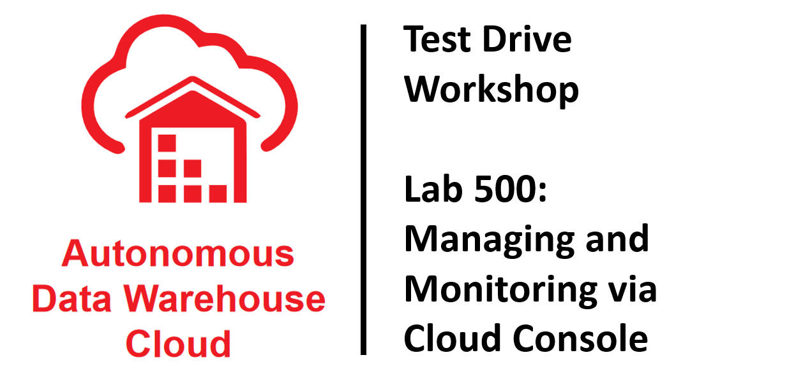

Draft Version. Updated: March 13, 2018

# ADWC Lab 500: Managing and Monitoring ADWC using the Cloud Console

## Introduction

For this lab you will **watch** a couple of demos to show the capabilities available via the Cloud Console and ADWC Service Console.

First you will see the Cloud Console and how you can stop, start, delete your instance, and how you can recover your database when needed. 

<a href="https://raw.githubusercontent.com/millerhoo/journey4-adwc/master/workshops/journey4-adwc/images/ADWC%20HOL%20Start%20Stop%20Recover.mp4" target="_blank">ADWC Start, Stop, and Backup/Recover video</a>

You can use the ADWC service console to monitor the performance of your ADWC instance. Service console provides dashboards to monitor the real-time and historical CPU and storage utilization, and database activity like the number of running or queued statements. It also provides Real-Time SQL Monitoring to  look at current and past long running SQL statements in your instance and allows you to cancel long running queries or set thresholds for ADWC to automatically cancel them for you.

The following demo will walk you through the service console and show you a running workload.

<a href="https://raw.githubusercontent.com/millerhoo/journey4-adwc/master/workshops/journey4-adwc/images/ADWC%20HOL%20Service%20Console.mp4" target="_blank">ADWC Service Console and Monitoring video</a>

To **log issues**, click [here](https://github.com/millerhoo/journey4-adwc/issues/new) to go to the github oracle repository issue submission form.

